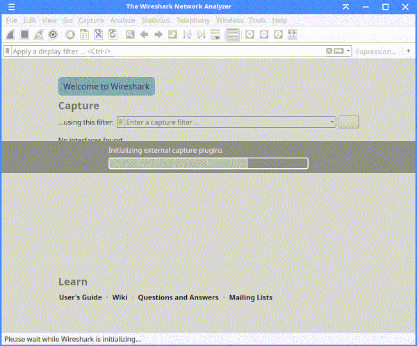

# ESP8266 PCAP Sniffer - RTOS SDK Version

ESP8266 Sniffer firmware which outputs PCAP data via UART. Use the sniffer to
stream 802.11 packets from ESP8266 to Wireshark or dump into a PCAP file.

## Overview

An [ESP8266 RTOS-SDK](https://github.com/espressif/ESP8266_RTOS_SDK) based firmware which sniffs 802.11 packets using your
ESP8266 and streams it to Wireshark via the UART driver.

**Note:** Only 802.11 packets are sniffed atm. Change to your liking.

## Compile & Flash

You should have the RTOS SDK installed. Go to the examples/wifi path and clone
this project. Enter the project directory, change the sniffer options on the
menuconfig, compile and flash:

```sh
cd $IDF_PATH/examples/wifi
git clone https://github.com/z4ziggy/esp8266_pcap_uart.git
cd esp8266_pcap_uart
make menuconfig
make -j8 flash
```

Run `SerialShark.py` to forward the PCAP stream from the ESP8266 to Wireshark:

```sh
./SerialShark.py
```

